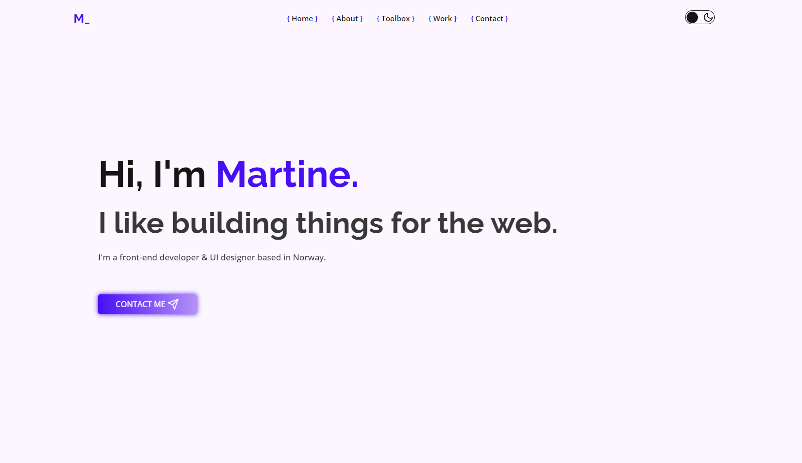

# My Portfolio

My portfolio website project.

Darkmode (default)

Lightmode

## Built with

HTML, SCSS, JavaScript

JavaScript bundler - Webpack

## Color Reference

| Color                | Hex                                                              |
| -------------------- | ---------------------------------------------------------------- |
| Electric violet      |  #470ff4 |
| Electric violet, 200 |  #a06dff |
| Lavender             |  #b694f6 |
| Smoky Black          |  #151515 |
| Eerie Black          |  #1e1b22 |
| White pointer        |  #fcf7ff |
| Cod grey             |  #383838 |

## Acknowledgements

- [Adobe Icons by Muhammad Haq](https://freeicons.io/profile/823) from [freeicons.io](https://freeicons.io)
- [Feathericons](https://github.com/feathericons/feather#feather)

## Inspiration

-[anniebombanie](https://anniebombanie.com/) -[brittanychiang](https://brittanychiang.com/)
